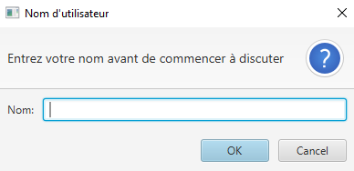

<h1>Application chat avec JavaFx, les sockets, et les threads</h1>

Cette application est une simple application de chat basée sur JavaFX avec une communication entre un serveur et un client via sockets.

<h3>Fonctionnalités</h3>
<pre>
✅ Serveur multi-client en Java avec ServerSocket
✅ Client en JavaFX avec interface utilisateur
✅ Popup pour demander le nom de l'utilisateur
✅ Affichage des messages avec le nom personnalisé
✅ Envoi et réception de messages en temps réel
</pre>

<h3>Fonctionnement</h3>
<pre>
Serveur : Attend les connexions des clients et gère les messages.
Client : Se connecte au serveur, affiche les messages et permet d'envoyer des messages.
Popup Nom d'Utilisateur : Lors du démarrage du client, une boîte de dialogue demande le nom de l'utilisateur.
Affichage des messages : Chaque message est affiché avec le nom de l'expéditeur.
</pre>

<h4>Exemple d'interface utilisateur</h4>

popup pour entre nom d'utilisateur

